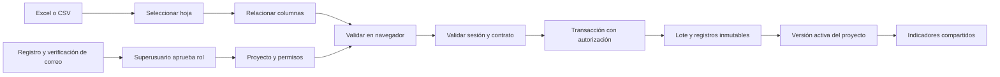

# Truper Workspace: base de producto

## Decisión de producto

Cada proceso manual tendrá un proyecto. Hoy la entrada es un Excel/CSV; después podrá ser una base de datos o integración. Cambiar el origen no debe cambiar el contrato del módulo ni su presentación.

La aplicación normal no incluye demostraciones, registros ficticios ni una alternativa anónima a las páginas protegidas. Sin sesión, muestra acceso. Sin registros, muestra estados vacíos. Sin permisos, no consulta ni modifica información del proyecto.

## Flujo implementado

## Contrato de ventas

`src/modules/registry.ts` registra el módulo y define cada indicador. Una fila es un movimiento, no necesariamente una factura. Importes en centavos enteros (máximo absoluto 100,000,000,000 por fila). Los importes representan la columna seleccionada; no se presupone si incluyen impuestos. Fechas ISO o fechas nativas de Excel. Clientes se cuentan por nombre exacto normalizado con trim, sin inventar un identificador comercial.

Una carga contiene 1–10,000 movimientos y actualiza una única versión activa. La versión anterior se conserva. La aplicación no guarda el binario del archivo, fórmulas ni formato de Excel; guarda registros normalizados y metadatos. Un UUID por intento permite reintentar sin duplicar la operación. Una fila inválida revierte la transacción completa.

La lectura actual cubre 60 días desde la fecha más reciente de las versiones activas. Un periodo de 7/14/30 días se compara con otro de igual duración. La lectura pagina en bloques de 1,000 y rechaza resultados de más de 50,000 filas sin mostrar totales parciales. Historial: últimas 200 cargas; actividad: últimos 100 eventos. El siguiente escalón de volumen requiere agregados SQL y paginación de servidor, no aumentar el bundle.

## Autorización

| Rol | Acceso |
| --- | --- |
| Superusuario | Todos los proyectos; aprueba/suspende usuarios y asigna permisos. |
| Administrador | Todos los proyectos; crea y carga; no administra cuentas. |
| Analista | Crea proyectos propios; lee/carga los propios y los asignados según permiso. |
| Consulta | Proyectos asignados; permiso de consulta o edición explícitamente asignado. |

Las nuevas cuentas nacen `pending/viewer` en un trigger que ignora roles enviados por el navegador. Los roles viven en `truper_profiles`, no en `user_metadata`. Sesión SSR con cookies y `getUser`; comprobación de estado en servidor y RLS. Las tablas no otorgan escritura a `authenticated`: mutaciones mediante funciones privadas con permisos explícitos y wrappers públicos invoker. La auditoría no tiene operaciones de edición o borrado. El superusuario no puede modificar su propio acceso desde la interfaz.

El perfil inicial se activa con `scripts/bootstrap-owner.mjs` después de verificar el correo. Ningún visitante se convierte automáticamente en propietario. La clave de servidor solo se usa en ese script puntual, nunca en el navegador ni en las consultas de la aplicación.

## Sistema de diseño compartido

- `globals.css`: dirección visual existente del dashboard y composición móvil.
- `platform.css`: tokens de movimiento, autenticación, formularios, estados y módulos adicionales.
- `components/ui/MetricCard.tsx`: componente que usa el dashboard y el catálogo de diseño.
- `components/ui/Dialog.tsx`: diálogo nativo, foco, Escape y retorno de foco.
- `components/ui/Brand.tsx`: recurso de marca real; SVG descargado de `https://www.truper.com/media/oneshot/brands/truper-lg.svg` el 2026-09-23.
- `modules/analytics/SalesChart.tsx`: datos comparables y alternativa tabular accesible.
- `/diseno`: catálogo de tokens, tipografía, componentes y definiciones de indicadores.
- `Providers`: tema persistente y respeto a movimiento reducido; animaciones cortas, sin bloquear el trabajo.

Cada nuevo módulo debe declarar contrato de entrada, reglas monetarias/unidades, permisos, normalización, métricas y estados. Debe usar los componentes comunes y validar móvil, teclado, tema oscuro, datos ausentes, errores y cifras extensas. No reutilizar métricas de ventas para inventario o cobranza sin revisar primero los archivos y las reglas reales.

## Próximos requerimientos

1. Aplicar y verificar la migración en el Supabase real; confirmar correo del titular y activar su cuenta.
2. Configurar URL pública, redirects Auth y variables en Vercel; verificar acceso y carga reales.
3. Recibir el primer Excel operativo y adaptar el parser al proceso exacto (filas de encabezado, fórmulas, duplicados y unidades).
4. Recuperación de versiones desde historial, archivo original en Storage privado, cuotas de almacenamiento y retención acordadas.
5. Nuevos módulos: inventario, pedidos o cobranza solo tras definir su contrato. Conectores externos y automatización después.

La carpeta `tests` contiene datos y una interfaz aislada exclusivamente para pruebas; no forma parte de las rutas de Next ni se publica. No confundir sus comprobaciones con una integración validada en producción.
